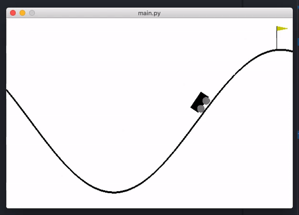

# Aprendizaje profundo por refuerzo aplicado a juegos sencillos

Trabajo Fin de Grado en Ingeniería Informática, Universidad Complutense de Madrid.

## Contenido

### Resumen

En este proyecto estudiaremos el campo del aprendizaje por refuerzo profundo, con el objetivo de lograr una aplicación estable en problemas clásicos de control. Para lograrlo investigaremos sus bases: el aprendizaje por refuerzo y las redes neuronales, comprobando cuáles son sus puntos fuertes y débiles. Después combinaremos lo aprendido para, progresivamente, mejorar el rendimiento y la estabilidad de nuestros agentes.

En busca de una mayor comprensión de su funcionamiento, todas las implementaciones de los agentes y algoritmos serán hechas por nosotros mis- mos. Todo ello será puesto a prueba a través del conocido sistema OpenAI Gym.

### Abstract

In this project we will study the Deep Reinforcement Learning field in order to achieve an stable application for classic control problems. To do this we will investigate its fundamentals: Reinforcement Learning and Neural Networks, learning which are their strengths and weaknesses. Finally, we will merge both to progressivly improve our agent’s performance and stability.

In order to gain a better insight we will personally implement the agents and algorithms. All of this will be tested through the popular framework OpenAI Gym.

### Estructura

En este repositorio pueden encontrarse las implementaciones que realizamos durante el transcurso del proyecto. El código está dividido en cuatro bloques:

#### 01_CartPole

En este apartado resolvemos el juego de control clásico CartPole mediante técnicas de aprendizaje por refuerzo.

#### 02_NeuralNetworks

Toma de contacto con las redes neuronales y Keras. Resolvemos problemas de clasificación  y regresión.

#### 03_CartPole_NN

Nos volvemos a enfrentar al entorno de CartPole, pero esta vez a través de una combinación de redes neuronales y aprendizaje por refuerzo.

Partimos de una implementación abstracta de un agente, de la cual heredan implementaciones progresivamente más refinadas y estables.

#### 04_MountainCar

Por último transferimos lo aprendido a otro entorno, en el cual surgen nuevos retos que nos hacen explorar otras formas de facilitar el aprendizaje (funciones de recompensa modificadas, random walks, etc.)

### Memoria

La memoria completa del proyecto puede encontrarse [aquí](https://github.com/delcanovega/TFG-Memoria).

### Configuración del entorno de desarrollo

Una pequeña guía de configuración puede encontrarse [aquí](SETUP.md).

## Autores

* **Ricardo Arranz Janeiro** - [Ricardo279](https://github.com/Ricardo279)
* **Lidia Concepción Echeverría** - [Lidiacon](https://github.com/Lidiacon)
* **Juan Ramón del Caño Vega** - [delcanovega](https://github.com/delcanovega)
* **Francisco Ponce Belmonte** - [frozenponce](https://github.com/frozenponce)
* **Juan Luis Romero Sánchez** - [JuanluR8](https://github.com/JuanluR8)

## Director

* **Antonio A. Sánchez Ruiz-Granados** - [antsanchucm](https://github.com/antsanchucm)